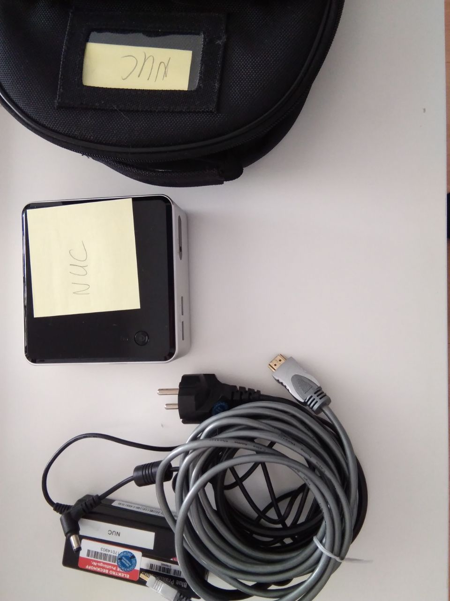
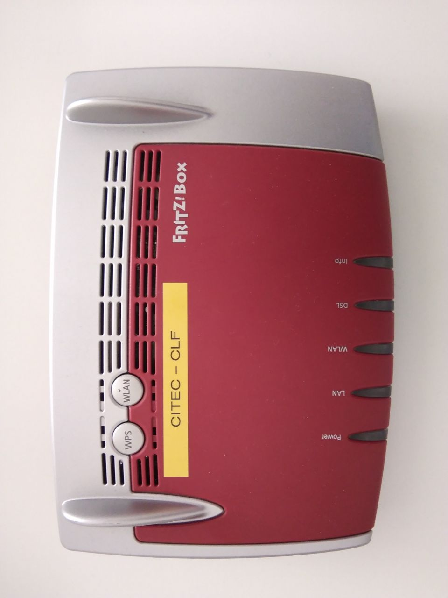
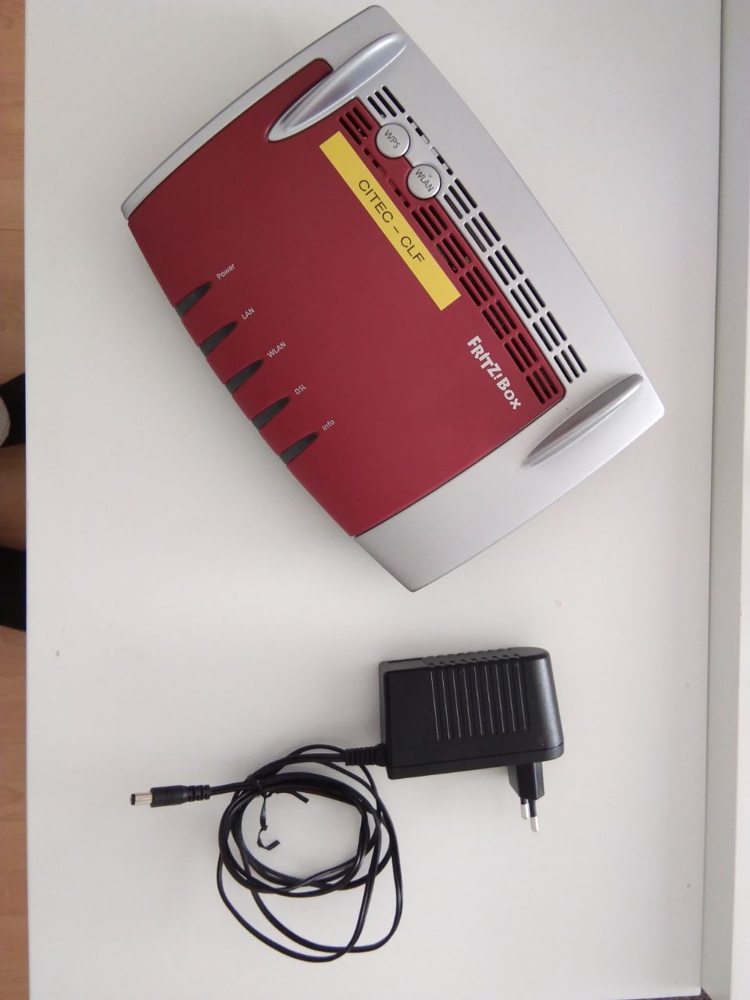
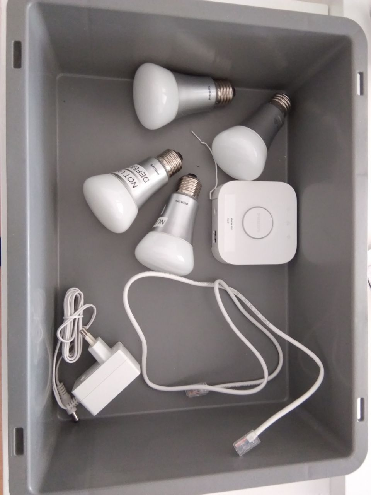
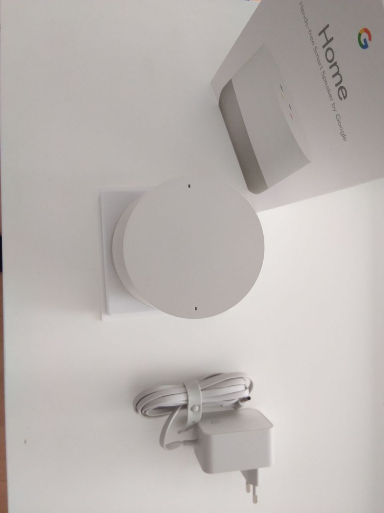

# Hardware

The following hardware is used for the master thesis project:

### intel NUC Model D54250WYKH (2014) - [Specifications](https://ark.intel.com/content/www/de/de/ark/products/81164/intel-nuc-kit-d54250wykh.html)

- Intel® Core™ i5-4250U Processor (3M Cache, up to 2,60 GHz)
- 16 GB DDR3L-1333/1600 1.35V SO-DIMM

<figure align="center"><figcaption>Intel NUC with bag and cables</figcaption></figure>

### FRITZ!Box 3490 - [Handbuch](https://assets.avm.de/files/docs/fritzbox/fritzbox-3490/fritzbox-3490_man_de_DE.pdf), [Kurzanleitung](https://assets.avm.de/files/docs/fritzbox/fritzbox-3490/fritzbox-3490_qig_de_DE.pdf)

<figure style="margin-left: 10%; margin-right: 10%"><figcaption>FRITZ!Box 3490</figcaption></figure><figure style="margin-left: 10%; margin-right: 10%"><figcaption>FRITZ!Box 3490 with power plug</figcaption></figure>

### Phillips Hue Light Bulbs and Hue Bridge control center

<figure align="center"><figcaption>4 Phillips HUE Lightbulbs and HUE Bridge</figcaption></figure>

### Google Home Assistant

<figure align="center"><figcaption> Google Home Assistant with power plug</figcaption></figure>