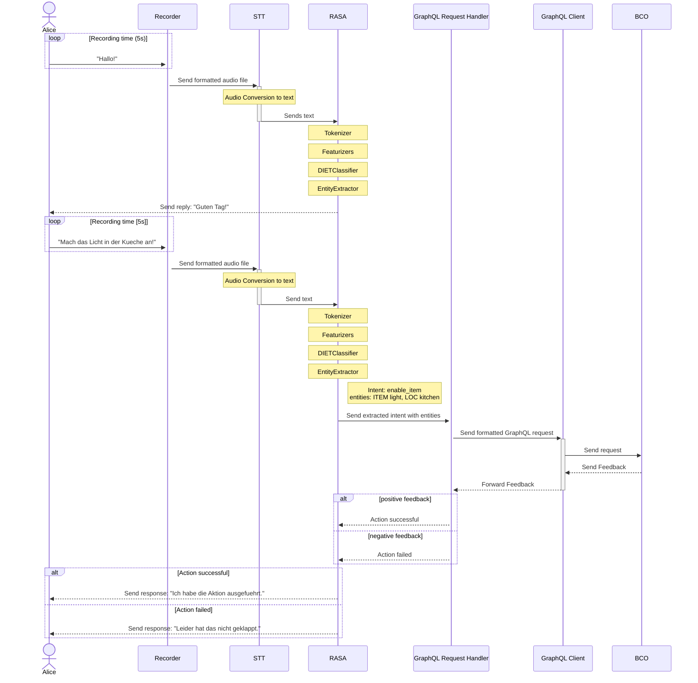

# Sequence Diagram 
## Full Conversation
Conversation with greeting and *enable light* request.

```mermaid
sequenceDiagram
    actor Alice
    participant Recorder
    participant STT
    participant RASA
    participant GraphQL Request Handler
    participant GraphQL Client
    participant BCO
    
    loop Recording time (5s)
        Alice->>+Recorder: "Hallo!"
    end
    Recorder->>+STT: Send formatted audio file
    Note over STT: Audio Conversion to text
    STT->>-RASA: Sends text
    Note over RASA: Tokenizer
    Note over RASA: Featurizers
    Note over RASA: DIETClassifier
    Note over RASA: EntityExtractor
    RASA-->>Alice: Send reply: "Guten Tag!"
    loop Recording time [5s]
        Alice->>+Recorder: "Mach das Licht in der Kueche an!"
    end
    Recorder->>+STT: Send formatted audio file
    Note over STT: Audio Conversion to text
    STT->>-RASA: Send text
    Note over RASA: Tokenizer
    Note over RASA: Featurizers
    Note over RASA: DIETClassifier
    Note over RASA: EntityExtractor
    Note right of RASA: Intent: enable_item <br>entities: ITEM light, LOC kitchen
    RASA->>+GraphQL Request Handler: Send extracted intent with entities
    GraphQL Request Handler->>+GraphQL Client: Send formatted GraphQL request
    GraphQL Client->>BCO: Send request
    BCO-->>GraphQL Client: Send Feedback
    GraphQL Client-->>-GraphQL Request Handler: Forward Feedback
    alt positive feedback
        GraphQL Request Handler-->>RASA: Action successful
    else negative feedback
        GraphQL Request Handler-->>RASA: Action failed
    end
    alt Action successful
        RASA-->>Alice: Send response: "Ich habe die Aktion ausgefuehrt."
    else Action failed
        RASA-->>Alice: Send response: "Leider hat das nicht geklappt."
    end
```